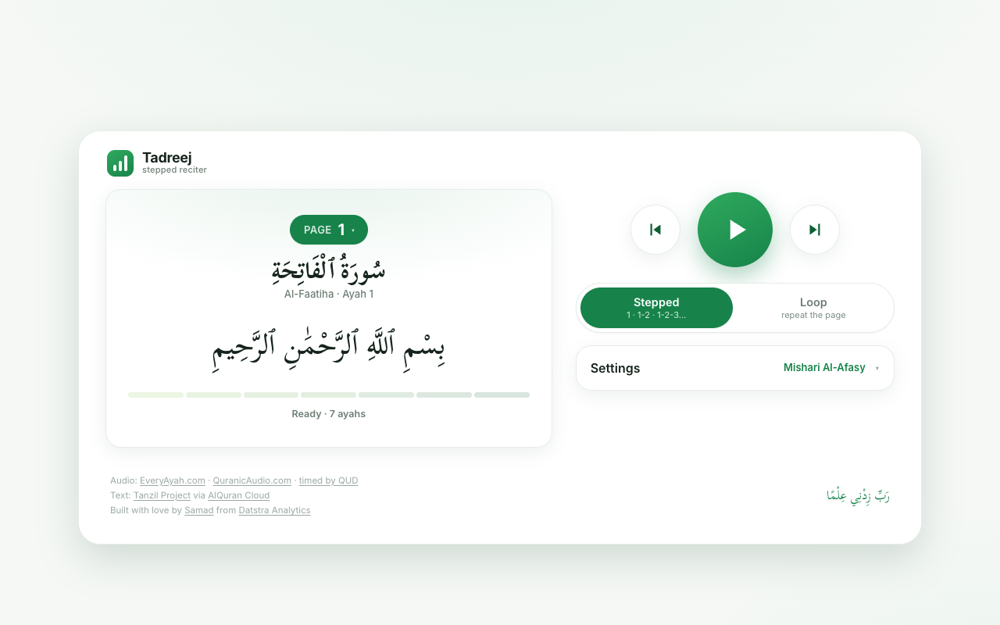

# Tadreej

A free, open-source player for memorising the Quran step by step: ayah 1, then 1–2, then 1–2–3, until the page is yours.

**Use it:** https://tadreej.samad.sh



## What it does

Pick a page, a range of pages, or a surah. Then pick a mode:

- **Stepped** plays ayah 1, then ayahs 1–2, then 1–2–3, so each new ayah joins the ones before it.
- **Loop** repeats the whole page, range or surah.

A range starts at the top of any page. It runs to the end of that page's surah, or to a page you choose. Once you have memorised the first pages, start a range at the next one, so stepping begins there instead of at ayah 1.

Tadreej runs in the browser and installs as an app on your phone. Playback continues with the screen locked, and lock-screen and headset controls move between steps.

## Deep links

| Link | Opens |
|---|---|
| `?page=50` | Page 50 |
| `?surah=67` | Surah 67 |
| `?from=50` | Page 50 to the end of its surah |
| `?from=50&to=52` | Pages 50 to 52 |
| `?mode=loop` or `?mode=stepped` | That mode |
| `?autoplay=1` | Starts playing at once, where the browser allows it |

## Feedback

To report a bug or suggest a feature, tap **Feedback** at the bottom of the app, then choose one. Each choice opens a short form on GitHub. You can also [open an issue](https://github.com/samadhusain/tadreej/issues/new/choose) from this repo. Both ways need a free GitHub account.

## Privacy

Tadreej has no accounts. Your settings stay in your browser. The site's host and the services it calls (everyayah.com, api.alquran.cloud, and the host of the two extra reciters) see your IP address, as with any website.

The site at tadreej.samad.sh counts page views with Cloudflare Web Analytics. It sets no cookies and does not fingerprint you. A copy you host yourself has no analytics.

**Report a bug** sends your page, settings and device details to GitHub, to fill in the form. Tadreej sends nothing until you tap the button. You can edit the form before you submit it. A submitted issue is public.

## Run it yourself

Requires Node 20.19+, 22.12+ or 24+.

```bash
npm install
npm run dev      # http://localhost:5173
npm test
npm run build    # writes dist/
```

The build serves from the root of a domain. To serve it from a subpath, set `VITE_BASE` when you build, for example `VITE_BASE=/tadreej/ npm run build`.

### The two extra reciters

Abdirashid Ali Sufi and Noreen Muhammad Siddique exist only as whole-surah recordings, so Tadreej cuts them into per-ayah files. The public site hosts these files. To host your own copy:

1. Install [uv](https://docs.astral.sh/uv/) and [ffmpeg](https://ffmpeg.org/).
2. Run `uv run --python 3.13 scripts/build_audio.py cut`. It downloads each surah and cuts it into `tadreej-audio/`, about 2.7 GB for both reciters. It skips files that already exist.
3. Serve `tadreej-audio/` from a web server.
4. Build the app with `VITE_EXTRA_AUDIO_BASE` set to that address, for example `VITE_EXTRA_AUDIO_BASE=https://audio.example.com npm run build`.

The timings are already in `scripts/timings/`, so you only need the `cut` step. The recordings are QuranicAudio's, and their terms cover personal, non-commercial use.

## Credits and license

The source code is MIT licensed; see [LICENSE](LICENSE). The page and surah data and the verse timings keep their own licenses, and the recordings belong to their reciters and publishers. [ATTRIBUTION.md](ATTRIBUTION.md) lists each one.

If you hold rights to any recording served here and want it removed, [open an issue](https://github.com/samadhusain/tadreej/issues) and we will take it down.

---

Built with love by [Samad Husain](https://github.com/samadhusain) from [Datstra Analytics](https://datstraanalytics.com).
